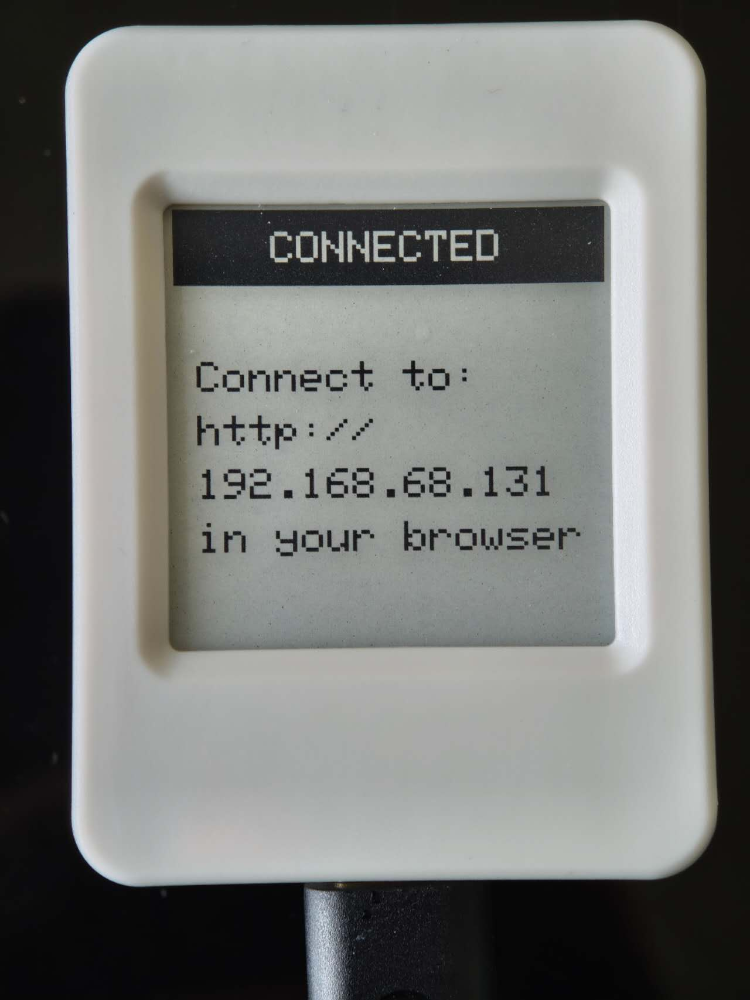
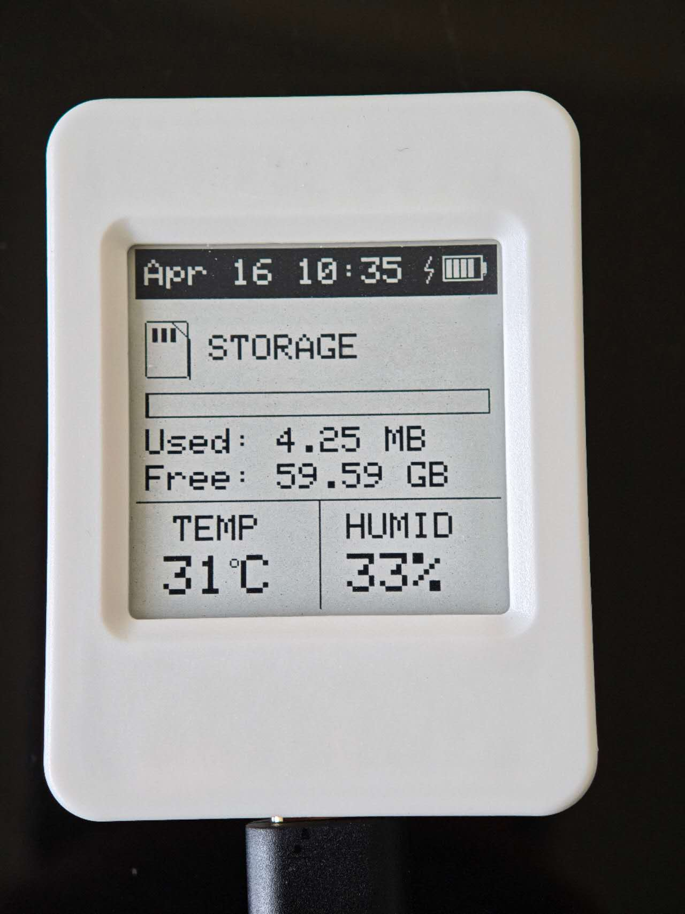

# Hardware Controls & Device Interface

## E-Paper Display
The current version supports two screens after setup: Connected and Dashboard. (Future versions will introduce more screens)

### Connected Screen
The connected screen is displayed when the device is connected to a WiFi network. It displays the IP address of the device.
 

### Dashboard Screen

The Dashboard screen displays the following information:
- Current date and time
- Battery charging status and battery level (when a battery is attached)
- SD card used level bar
- SD card used storage
- SD card free storage
- Current temperature
- Current Humidity level

 

## Buttons

### BOOT Button (GPIO 0)

* **Single Click:** Navigate forward to the next UI screen view (e.g., Dashboard -> Connected).
* **Double Click:** Navigate backward to the previous UI screen view.
* **Long Press (Hold for 5 seconds):** Factory Reset Network. This clears all saved WiFi credentials from NVS space and triggers an immediate hard crash/reboot to return to Captive AP mode.

### PWR Button (GPIO 18)

* **Single Click:** Toggles the global power mode between "Eco Mode" (which enters deep sleep within 30 seconds after a click) and "Constant Mode" (Device is active all the time). (*NOTE: Once the device is in deep sleep, pressing the "PWR" button will wake it up immediately and change it to constant mode.*)
* **Double Click:** Synchronise RTC time with NTP server.
* **Long Press (Hold for 5 seconds):** Initiates a standard soft reboot.