# Web Portal

## 1. Captive Portal and Access Point
- After flashing the code to the device, it will automatically create an access point with the name "EPY_Setup" and display the IP address of the device on the e-paper screen.
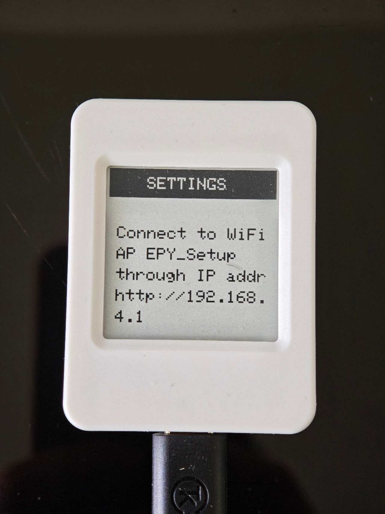

- After connecting to the access point, you can access the web portal by navigating to `http://192.168.4.1` in your web browser. Then you can scan for available WiFi networks and connect to one with the password.
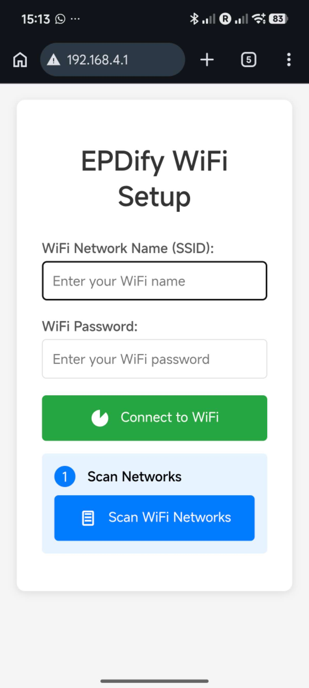

## 2. Dashboard and System settings
### Dashboard
- Once setup is complete, the device will display the IP address of the device on the e-paper screen.

- Navigate to the web portal, and you will land on the Dashboard screen by default.
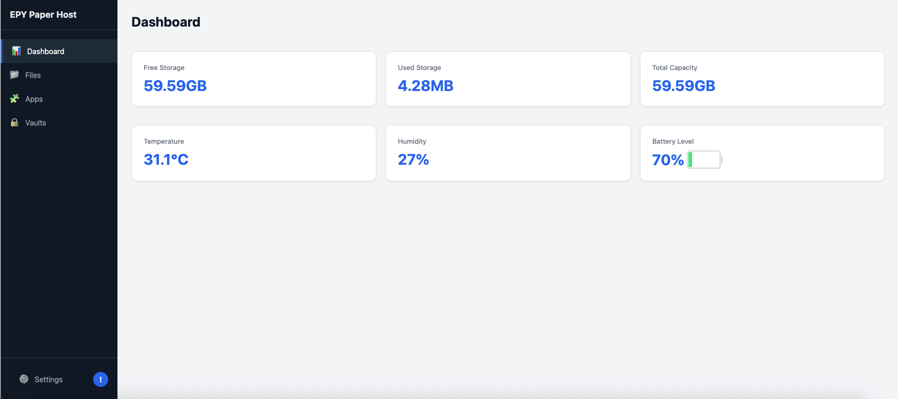 The Dashboard screen displays the following information:
  - SD card free storage
  - SD card used storage
  - SD card capacity
  - Device temperature
  - Device humidity
  - Battery level and charging status (if you have one attached)

### Settings and System Info
- **Settings modal:** Clicking the "Settings" button at the bottom left will open the settings modal, which allows you to update the following system settings:

  - ***Enable Eco Mode:*** Once ticked, Eco mode puts the device to deep sleep and wakes it up every "interval" minutes (screen rotation interval, by default 10 minutes) to update the display. Constant mode will keep the device active all the time. (*NOTE: Once the device is in deep sleep, pressing the "PWR" button will wake it up immediately and change it to Constant mode.*)

  - ***Battery Attached:*** At a software level, the device can register/unregister a battery attached. It's useful when users want to hard restart the device while a battery is physically connected.

  - ***Screen Rotation Interval:*** It determines how often the screen will update. In Eco mode, it is the wakeup frequency (with updates), while in Constant mode, it decides the interval between two updates.

  - ***Default Screen:*** It determines the default screen to display when the device wakes up from deep sleep.

  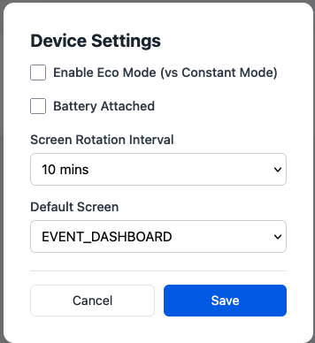

- **System Info:** Clicking the "!" symbol at the bottom left corner (along with "Settings") opens the system info modal, which displays the Firmware Version and a "Reboot" button to reboot the device. (*Remember: Every change on the "Apps" screen requires a reboot to take effect.*)

    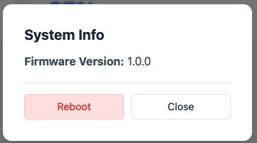

## 3. File Manager
The File Manager lists out all the files and folders on the SD card attached. You can create, delete, update, download files or open a file with a custom/personal editor from the "Apps".

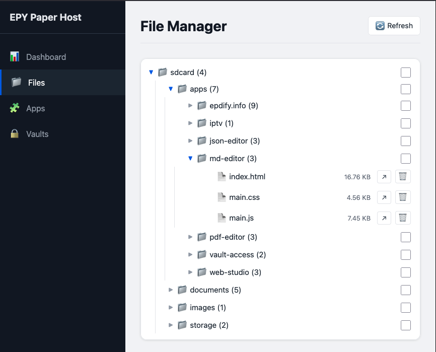

- **Delete a file or folder:** For folders, tick the checkbox next to one or more folder names, click the "Delete Folder(s)" button at the top right corner, and confirm the deletion. File deletion can be done by deleting the entire folder containing the files, or by clicking the "Trash" icon next to the file name to delete them individually (a file deletion confirmation modal appears to avoid mistakes).

- **Create a folder:** Tick the checkbox next to the folder name where you want to create a subfolder. Then click the "New Folder" button at the top right corner and confirm the folder name in the popup.

- **Upload/Create a file:** Tick the checkbox next to the folder name where you want to upload/create a file. Then click the "Upload File" button at the top right corner to open the Upload modal. The modal provides two options:
    - ***Select Files:*** By default, you can select or drag and drop multiple files to the dropzone and click the "Upload" button to upload them to the target folder. (Currently, the device doesn't support uploading folders.)
    - ***Paste Content:*** You can also choose to specify the filename, copy and paste the content of a file into the text area, and click the "Upload" button to upload it to the target folder. NOTE: The text area cannot be empty. 

  ***NOTE: If a file with the same name already exists in the target folder, it will be overwritten without any warning.***     

- **Download a file:** Click the "Actions" icon (arrow icon) next to the file name you want to download, and click the "Download File" button in the "Actions" modal.

- **Open a file with custom editor:** In the "Actions" modal, you can also open the file with the custom editor from the "EPY Editor" dropdown.

## 4. Apps and Routing
The "Apps & Links" screen manages SPAs and internal/external links. The screen loads them in a grid, with links on a white background and SPAs on a green background with an "EPY" label at the top left corner. Use the "EPY apps only" checkbox to filter out the links in the grid.

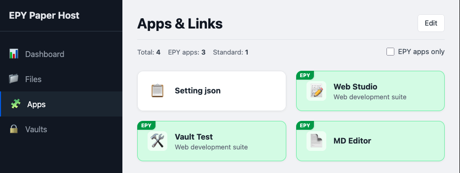

Click the "Edit" button at the top right corner to enter edit mode. In edit mode, you can add, edit, or delete apps and links. (NOTE: Every change on the "Apps" screen requires a reboot to take effect.)

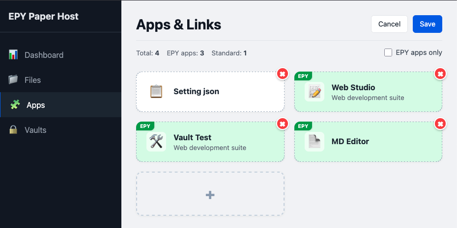

In edit mode, click the Placeholder card (with a + symbol in the middle) to add a new app or link, or click existing app/link cards to edit them. Both actions open the same modal with the following fields:

- **Name:** The name of the app or link. It will be displayed on the card. Mandatory.

- **Description:** Optional field for the description of the app or link. It will be displayed below the name on the card.

- **Endpoint / URL:** The URL of the app or link in a browser. Mandatory. For EPY apps, the relative URL is required to end with a trailing slash.

- **Icon:** The icon of the app or link. It will be displayed on the card. Optional.

- **Is an EPY App?** A checkbox to indicate if the app is an EPY app. Ticking the box will reveal EPY app specific fields.

- **App path (on SD):** The path to the root folder of the single-page application on the SD card. Mandatory for EPY apps.

- **Is Editor?** A checkbox to indicate if the app is an editor. If checked, the app will be added to the "EPY Editor" dropdown in the File Manager for users to open a file with it.

- **Supported Extensions:** Lists all the file extensions that the editor supports, separated by commas. The "Actions" modal in the File Manager will try to match the file extension with the supported extensions list, select the appropriate editor from the dropdown, and display it as the default option.

  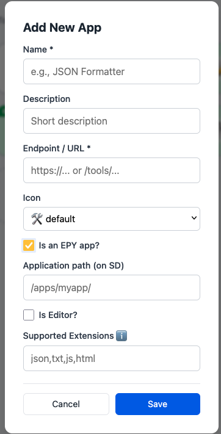

## 5. Vault System
The Vault system is a password-protected system for storing sensitive information in the internal non-volatile storage (instead of the SD card) and securely supplies them to secure apps during an active/valid secure session. 

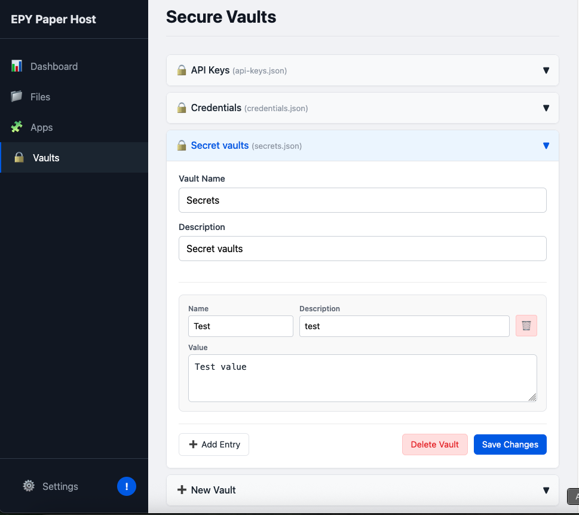

- **Create Password:** When the device is set up, clicking on "Vaults" for the first time will open a password creation modal to set up the password and hint for the vaults. The password will be hashed using SHA256 and stored in the non-volatile storage. The hint will be displayed on the "Vault Locked" modal to help you remember the password. 

- **Authentication:** After the 30-minute session expires, access to the vaults will be locked, and you will need to re-authenticate to access the vaults. Clicking on "Vaults" will open the "Vault Locked" modal. Enter the password and click the "Unlock" button to renew the secure session for another 30 minutes.

  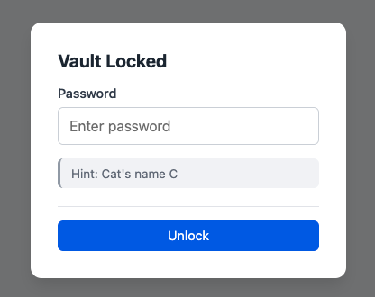

- **Add Vault:** Click the "Add Vault" button at the bottom of the accordion to add a new vault. Specify a filename with a .json extension (e.g., secrets.json). The filename is used as an identifier when integrating with a secure app. 'Name' is the vault name that appears on the accordion, and the description field is optional.

  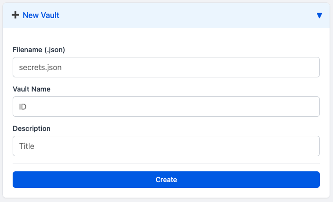

- **Manage Vault:** While opening a vault, you can add, edit, or delete secure entries in the vault. The "Trash" icon within an entry is for deleting the entry. The "Add Entry" button is for adding a new entry. The "Delete Vault" button is for deleting the entire vault, while "Save Changes" saves all modifications. All changes will be safeguarded by a "Confirmation" modal to avoid mistakes.

  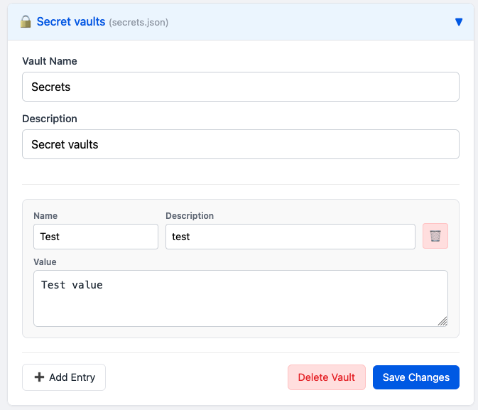

  ***NOTE:*** The vault system has a limitation of 1MB storage.

  